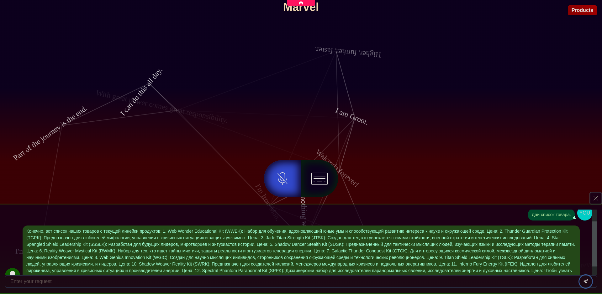
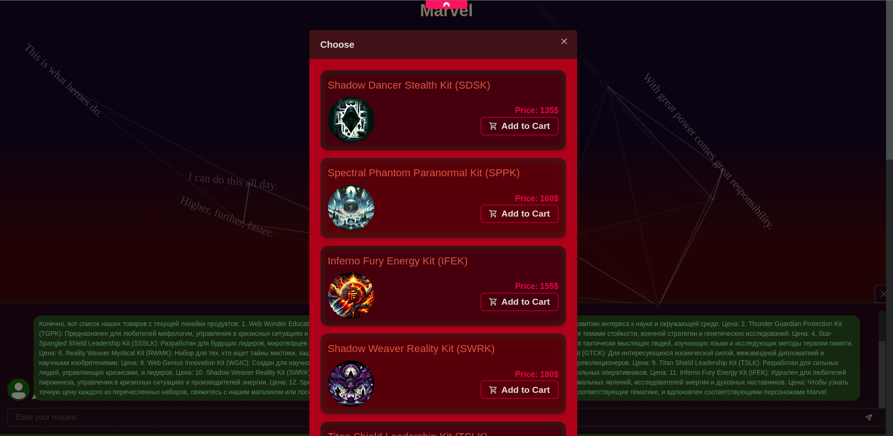
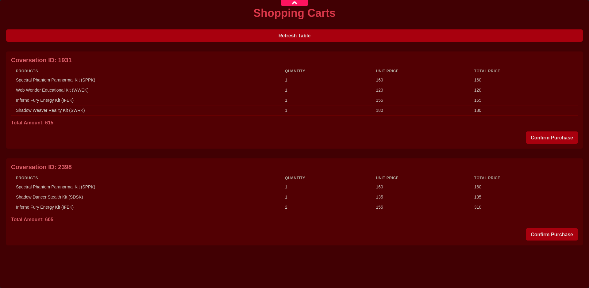

## Project name: store-ai-consultant

### Description:

The project "store-ai-consultant" was developed as part of a university practice and is an innovative solution for improving the shopping experience. The assistant based on artificial intelligence and GPT-4 algorithms offers personalized recommendations based on the user's needs and preferences. The project's special feature is that you can communicate with it both by text and voice, which makes the process of choosing products more convenient and intuitive.

When interacting with "store-ai-consultant", users can conveniently add selected products to a virtual basket. This functionality not only simplifies the selection process, but also allows customers to review their choice, make changes or make purchase decisions at any time without rushing.

When the user is ready to place an order, the system generates a unique order number after confirming the selection of products in the basket. This number can then be presented to the seller, which allows him to quickly find the prepared order in the system and place it after full payment. Thus, “store-ai-consultant” minimizes the waiting time and makes the shopping process more comfortable and organized for the customer.

The goal of the project is to improve the retail industry by creating a more personalized, convenient and efficient shopping experience, offering a modern approach to retail and increasing customer satisfaction.

### Additional information:

Built on the open-source Deep Foundation platform, "store-ai-consultant" integrates powerful APIs such as Google Speech for voice recognition, Capacitor’s Voice Recorder for audio input, OpenAI’s ChatGPT for conversational intelligence, and Loyverse POS for point-of-sale operations. To make this integration possible and tailored to the project’s needs, I developed custom packages for these APIs. These packages, crafted from scratch, ensure smooth functionality and adaptability, while also being shared with the developer community through NPM repositories to support collaborative innovation.

Deep Foundation uses a PostgreSQL-based system through Hasura, which works with ternary and dual networks. It allows data and code management through universal data exchange with short-term interactions between different programs and languages. This approach enables dynamic programming and data exchange, creating more versatile and flexible software. For more information, visit the Deep Foundation page.

The project’s use of TypeScript, JavaScript, React, Next.js, and Capacitor, combined with the core technologies of GraphQL, Hasura, Postgres, and MinIO provided by Deep Foundation, illustrates a multifaceted approach to building scalable, adaptive, and intuitive applications. By adding additional components to the NPM repositories, the project not only enriches the developer community, but also sets new standards for collaborative and open development. This means pushing the boundaries of what’s possible, harnessing the collective power of these technologies to create seamless and enriching user experiences.

### Several screenshots of the application

